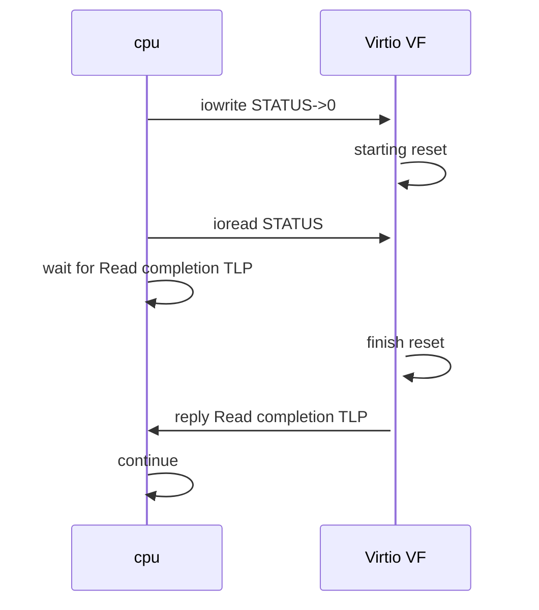

### 问题背景

最近，在讨论如何在mlnx硬件卸载场景上支持virtio 0.95，因为virtio 0.95协议本身对硬件virtio直通不够友好，所以需要做些特殊的quirks处理。

面临最棘手的问题便是：virtio 0.95规范中对STATUS寄存器没有约定需同步等待，导致某些较老版本的virtio legacy驱动无法支持。举例来说：

```c
static void vp_reset(struct virtio_device *vdev)
{
	struct virtio_pci_device *vp_dev = to_vp_device(vdev);
	/* 0 status means a reset. */
	iowrite8(0, vp_dev->ioaddr + VIRTIO_PCI_STATUS);
}
```

上述为Linux 2.6.39中virtio legacy驱动的实现，可见：**在reset设备时，将STATUS清零后直接返回**。

在QEMU模拟virtio场景下，此方式无问题，因为iowrite将引起陷出，最终由QEMU进行相应reset操作。

但是在硬件virtio VF直通场景下，cpu下发完reset请求后，VF硬件可能还没有处理完成，cpu便可继续执行后续操作，这便存在潜在风险：后续操作的正确性可能依赖于VF硬件已经reset完成，而彼时VF硬件可能尚在reset过程中（e.g. **后续运行过程中读取STATUS时，可能STATUS寄存器依然不为零**）。

&nbsp;

### 关键分析

#### cpu通过iowrite操作PCIe设备能否阻塞cpu？

在linux内核中，iowrite实际上有pio、mmio两种具体实现方式，首先需要明白我们场景中使用的是哪一种！

我们通过SR-IOV + vfio-pci直通方式将virtio VF直通给虚拟机，SR-IOV规范有个限制：**VF只支持memory BAR、不支持io BAR，因此对其访问只能是以mmio方式**。

说下答案：**不能!!!!**

如果mmio能够阻塞就好了，就能够在设备reset完成后再让cpu继续执行下去，我们就不会遇到上面的问题了。

那么，为什么不能呢？

mmio write属于“Memory write”操作。在PCIe体系中，Memory write属于**Posted Transactions**，requester（此处即cpu）不需要等待completion TLP，可以立刻去干别的事情，类似导弹技术中的“发射后不管”。

&nbsp;

#### 较新的virtio legacy驱动是否有同步？

来看一下Linux 5.12中virtio legacy驱动的相关实现：

```c
static void vp_reset(struct virtio_device *vdev)
{
	struct virtio_pci_device *vp_dev = to_vp_device(vdev);
	/* 0 status means a reset. */
	iowrite8(0, vp_dev->ioaddr + VIRTIO_PCI_STATUS);
	/* Flush out the status write, and flush in device writes,
	 * including MSi-X interrupts, if any. */
	ioread8(vp_dev->ioaddr + VIRTIO_PCI_STATUS);
	/* Flush pending VQ/configuration callbacks. */
	vp_synchronize_vectors(vdev);
}
```

我们可以看到：在reset之后，多了一个ioread的动作。根据注释，此处ioread的原因并不是为了和底层硬件进行同步，而仅仅是为了确保上面的iowrite操作能够flush out或者设备的写操作能够flush in，主要是站在cpu角度进行内存屏障之类的处理。

但是，**这却为硬件virtio 0.95实现创造了一个机会，可以利用ioread做文章**。

ioread在我们分析的场景中是mmio read，属于“Memory read”操作，此类请求属于**Non-posted Transactions**，意味着requester（此处即cpu）需要等待PCIe硬件回复completion TLP方可继续。如此一来，便可以借机实现“伪同步”的效果：



可以看到：只要Virtio VF硬件中控制好在reset处理完成后才能处理后续请求（即读请求），便能够实现“同步”的效果。

&nbsp;

#### virtio modern驱动能够实现同步？

来看一下Linux 5.12中virtio modern（ >= virtio 1.0）驱动的实现：

```c
static void vp_reset(struct virtio_device *vdev)
{
	struct virtio_pci_device *vp_dev = to_vp_device(vdev);
	struct virtio_pci_modern_device *mdev = &vp_dev->mdev;

	/* 0 status means a reset. */
	vp_modern_set_status(mdev, 0);
	/* After writing 0 to device_status, the driver MUST wait for a read of
	 * device_status to return 0 before reinitializing the device.
	 * This will flush out the status write, and flush in device writes,
	 * including MSI-X interrupts, if any.
	 */
	while (vp_modern_get_status(mdev))
		msleep(1);
	/* Flush pending VQ/configuration callbacks. */
	vp_synchronize_vectors(vdev);
}

/*
 * vp_modern_get_status - get the device status
 * @mdev: the modern virtio-pci device
 *
 * Returns the status read from device
 */
u8 vp_modern_get_status(struct virtio_pci_modern_device *mdev)
{
	struct virtio_pci_common_cfg __iomem *cfg = mdev->common;

	return vp_ioread8(&cfg->device_status);
}
EXPORT_SYMBOL_GPL(vp_modern_get_status);
```

可以看到：驱动将主动等待STATUS变为0。**当然，Virtio设备需要在reset操作处理完成后，才将STATUS复位成0**。

个人认为，此种驱动实现方式对硬件（virtio VF、cpu）更加友好：

+ “较新的virtio legacy驱动”需要Virtio VF硬件中实现：read STATUS操作需要等到reset操作结束后才能回复completion TLP，增加了硬件内部实现的复杂度；而“virtio modern驱动”不需要VF硬件做类似保障，reset操作与read STATUS操作是解耦的，无内在牵连。
+ 如果reset操作耗时较久，“较新的virtio legacy驱动”将导致cpu一直处于等待read STATUS响应的状态；而“virtio modern驱动”可以通过msleep主动触发任务调度。

&nbsp;

#### 总结

（**注意：我们描述的是virtio硬化的问题，虚机场景是指通过vfio-pci直通给VM的使用场景**）

| 驱动                         | 支持裸机 | 支持虚机                                                     | 支持同步 | 硬件复杂度<br />（为支持同步） |
| :--------------------------- | -------- | ------------------------------------------------------------ | -------- | ------------------------------ |
| 较老的legacy virtio 0.95驱动 | N        | N：直通无特殊处理<br />Y-：直通，但QEMU quirk BAR然后同步等待 | N        | -                              |
| 较新的legacy virtio 0.95驱动 | Y-       | Y-                                                           | Y-       | High                           |
| modern virtio 1.0/1.1驱动    | Y        | Y                                                            | Y        | Low                            |

&nbsp;

- 较老的legacy驱动
	- 不支持裸机，目前无任何办法
	- 对虚机的支持需要hypervisor辅助：
		- 不辅助的话无法支持
		- 辅助方式：截获virtio BAR的访问，对于STATUS clear需实现等待机制
	- 不支持reset同步

- 较新的legacy驱动
	- 支持裸机，在read STATUS回复时需要保证STATUS clear已完成
	- 支持虚机：
		- 截获virtio BAR的访问，对于STATUS clear需实现等待机制
		- 无需截获，由硬件保证“在read STATUS回复时需要保证STATUS clear已完”。此种场景下关键的问题是：hypervisor本身感知不到guest内部所用驱动的版本，如何确定是否需要截获？
	- 支持reset同步：
		- 个人称之为“伪同步”，最终能达到同步的效果，只能说是“误打误撞”，驱动的行为刚好可以被利用
	- 因reset同步，硬件实现复杂度高
- modern驱动
	- 比较合理的驱动/协议实现，是最合理的解决方案。这得益于随着硬件virtio普及，virtio社区与时俱进的更新。

